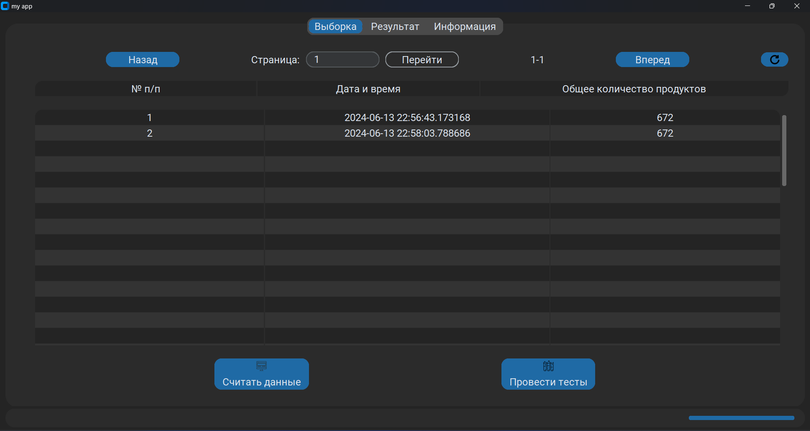
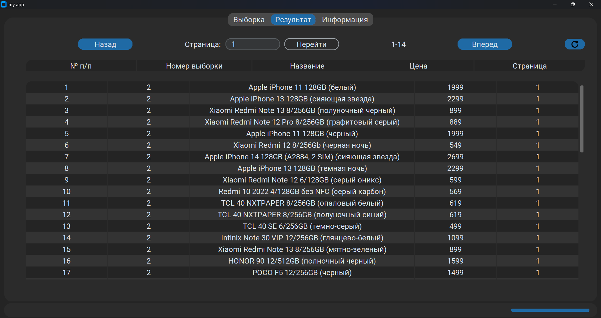
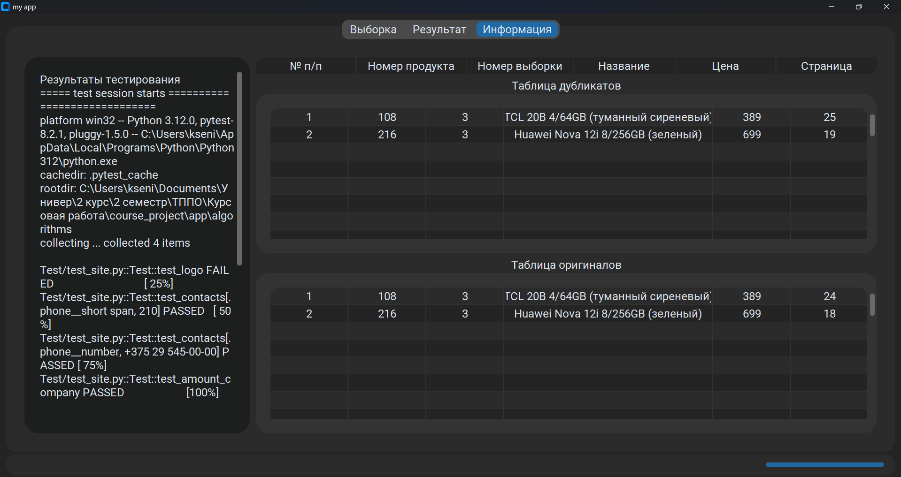

<div align="center">
<h2>
Система сбора данных с площадок интернет-торговли
</h2>
</div>

Этот проект представляет собой программу для парсинга электронно-коммерческих
сайтов. Он автоматизирует сбор данных о продуктах и ценах. Сайт, с которого
собираются данные - https://shop.mts.by.


| _Главное окно программы_
###


| _Вкладка "Результат" программы_
###


| _Вкладка "Информация" программы_
###

## Технологический стек
Версия Python: `Python 3.12`

Используемые библиотеки:
```
customtkinter
sqlite3
pytest
CTkTable
PIL
tkinter
sys
math
requests
bs4
asyncio
aiohttp
datetime
```

## Установка
Для установки и запуска проекта выполните следующие команды:
```bash
git clone https://github.com/gleb7499/course_project_4_term.git
```
```bash
cd tppo
```
```bash
pip install -r requirements.txt
```
**Примечание:** для выполнения 3-ей команды, на компьютере должен быть установлен [Python](https://www.python.org/downloads/).

## Использование
Для начала работы с программой запустите файл [UI.py](app/algorithms/UI.py)
в любом IDE (например, [PyCharm](https://www.jetbrains.com/ru-ru/pycharm/download/?section=windows)).

## Лицензия
Данный проект распространяется под [лицензией](LICENSE) MIT.

## Автор
Проект разработан [Логиновым Глебом Олеговичем](https://github.com/gleb7499/).

---

#### Примечание: в связи с тем, что сайт https://shop.mts.by убрал пагинацию со своей страницы, работоспособность кода нарушена!