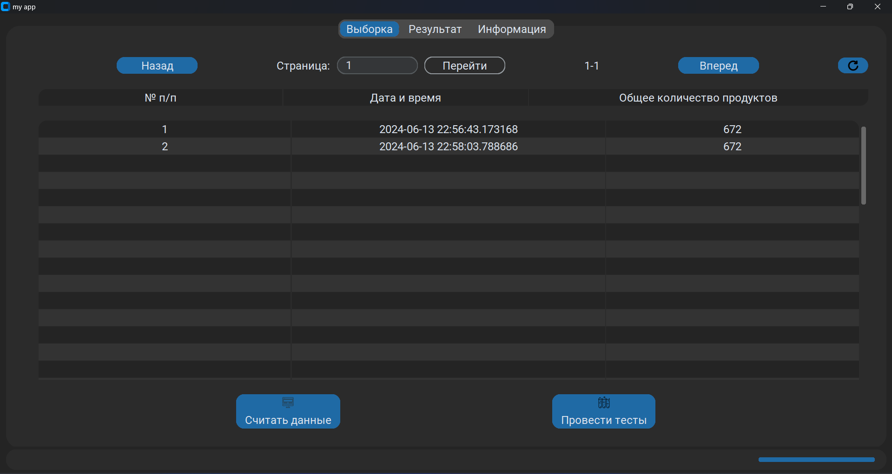
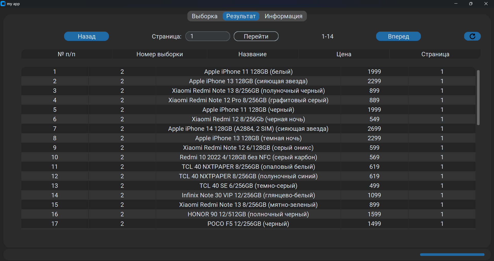
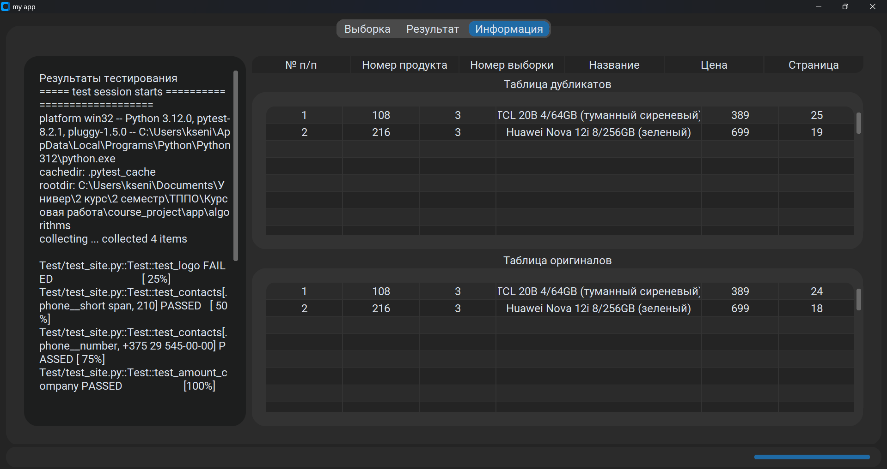

<div align="center">
<h2>
Data Collection System for E-Commerce Platforms
</h2>
</div>

This project is a program for parsing e-commerce websites. It automates the
collection of product and price data. The website the data is collected from
is https://shop.mts.by.


| _Main window of the program_
###


| _"Result" tab of the program_
###


| _"Information" tab of the program_
###

## Technology Stack
Python version: `Python 3.12`

Libraries used:
```
customtkinter
sqlite3
pytest
CTkTable
PIL
tkinter
sys
math
requests
bs4
asyncio
aiohttp
datetime
```

## Installation
To install and run the project, execute the following commands:
```bash
git clone https://github.com/gleb7499/course_project_4_term.git
```
```bash
cd tppo
```
```bash
pip install -r requirements.txt
```
**Note:** to run the 3rd command, [Python](https://www.python.org/downloads/) must be installed on your computer.

## Usage
To start working with the program, run the file [UI.py](app/algorithms/UI.py)
in any IDE (for example, [PyCharm](https://www.jetbrains.com/ru-ru/pycharm/download/?section=windows)).

## License
This project is distributed under the [MIT license](LICENSE).

## Author
The project was developed by [Gleb Olegovich Loginov](https://github.com/gleb7499/).

---

#### Note: since the website https://shop.mts.by removed pagination from its page, the code no longer works!
